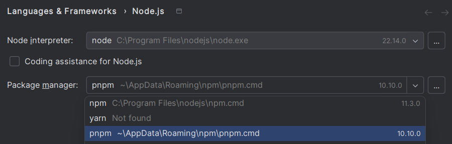

## Frontend / Next.js

If **pnpm** is not installed:
```bash
npm install -g pnpm
```

Select **pnpm** as package manager in IDE (optional), to prevent accidental npm commands:


Make sure you are in frontend folder:
```bash
cd frontend
```

Install dependencies:
```bash
pnpm install
```

Start the development server:
```bash
pnpm dev
```

Open [http://localhost:3000](http://localhost:3000)